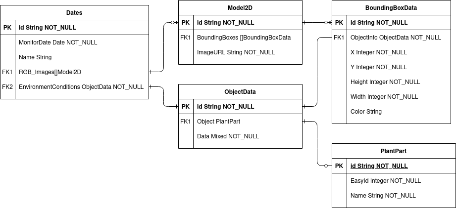

# p4p-backend-storage-js
Backend service used for managing the data of the plant monitoring project.

## Requirements
* [NodeJS](https://nodejs.org/en/download/) - V12+
* NPM (Comes with NodeJS)
* [MongoDB Server](https://www.mongodb.com/try/download/community) (Locally hosted or Atlas works fine)

## Information
This backend handles data in the form of entity relationships as shown in this diagram below:


## Pre-Installation Steps
Run the command in the working directory.
```bash
npm install
```

Optional: Create a `.env` file to setup environment variables for use when configuring server. See `.env.example` file for a sample setup.

## Populating database (Optional)
Run the following command to populate the database.
```bash
npm run init-db
```
DO NOT run this in production as this clears all the data in the database.

WARNING: Command may not work in Windows since there is unix commands used to initialise dummy data. In this case, go to `./public/api` and copy `examples` folder and rename the copy to `images`.

## Running the server
Run the command in the working directory to start in development mode.
```bash
npm start
```

Or run this code if in production mode:
```bash
npm run production
```

## Supported URLS
### GET:

#### Dates: 
* `http://localhost:3001/api/dates` - Gets all available dates.
* `http://localhost:3001/api/dates/id/ID` - Get a date with supplied Object ID.
* `http://localhost:3001/api/dates/envRef/ID` - Get a date with supplied Environment Reference Object ID.

#### Images: 
* `http://localhost:3001/api/images/URL` - Get locally stored image with shortened URL.

Image Info:
* `http://localhost:3001/api/imageinfo/allinfo/ID` - Fetch information about an image given its ID.

#### Plant Parts:
* `http://localhost:3001/api/plant-parts/id/ID` - Fetch a plant part based on its ID
* `http://localhost:3001/api/plant-parts/query?itemType=TYPE` - Fetch all plant parts based on its TYPE (only option is `fruits`).

#### Object Data:
* `http://localhost:3001/api/object-data/info/ID` - Fetch ObjectData based on ints own Object ID.
* `http://localhost:3001/api/object-data/plant-part/ID` - Get ObjectData info based on the associated Plant Part ID.

### POST:


* `http://localhost:3001/api/images/image?name=NAME&date=DATE` - Upload image to backend file storage based on its NAME and DATE. DATE is folder name. NAME is filename without extensions.
* `http://localhost:3001/api/plant-parts/create?name=NAME&date=DATE` - Create a new Plant Part. NAME is the name of the plant part. DATE is optional but modifies created date. Can be useful for stating Fruit bearing time.
* `http://localhost:3001/api/object-data/create` - Creates a list of Object Data info. Multiple data information can be sent in one go.
* `http://localhost:3001/api/dates/entry` - Creates a new date entry. More information in the next section.

## How to add a date entry properly:
NOTE: Method URL must be `POST` and not `GET`.

1.) Post image to backend (because images take a lot of space) via this url:
```http
http://localhost:3001/api/images/image?name=NAME&date=DATE
```
where `NAME` is the name of your file without extensions and `DATE` is the folder the file will be stored at preferrably in YYYYmmdd.

Do this for each image.

Returns the image url which can be slotted after this url `http://localhost:3001/api/images/` to return the image later.

2.) OPTIONAL: 
```http
http://localhost:3001/api/plant-parts/create?name=NAME&date=DATE
``` 
can be used to create new plant parts with NAME being the name of the plant. DATE is optional but preferrably in UNIX timestamp if doing so.

Returns the `EasyId` that will be useful for the next step. This step can be skipped if no new plant parts introduced.

3.) Add ObjectData of respective plant-part(s) (can request multiple in 1 request) for said day and said image:
```http
http://localhost:3001/api/object-data/create
```
Request format to take the form (can have 1 or more than 2 JSON in the list depending on plant-part being updated):
```json
[
    {
        "EasyId": 0,
        "Volume": "56ml",
        "createdAt": 1620399800000
    },
    {
        "EasyId": 1,
        "Volume": "61ml",
        "createdAt": 1620399800000
    }
]
```
Returns the eager fetched ObjectDatas. The supplied ID fields are useful for linking ObjectID in the next step.

Although the `createdAt` field is optional, it is highly recommended to use this field and the same epoch value for the Date section of the next step to keep entry consistent and synced.

4.) Post the metadata needed for said images via this URL:
```http
http://localhost:3001/api/dates/entry
```
with the request body of the form:
```json
{
  "Date": 134354354, // Preferably in UNIX epoch time. Recommended, otherwise uses created time.
  "Name": "Can be any String",
  "EnvironmentConditions": { "Format": "Plain JSON form with key value string pairs" },
  "RGBImages": [ // List of RGB Images, form below.
    {
      "ImageURL": "/obtain_from_step_1",
      "BoundingBoxes": [ // List of Bounding Box JSON
        {
          "X": 69,
          "Y": 420,
          "Height": 69,
          "Width": 42,
          "Color": "Green", // QoL Box Label Customiser, also optional, default is “black”.
          "ObjectId": "ObjectID depending on step 3"
        }
      ]
    }
  ]
}

```

Example valid JSON format:
```json
{
    "Date": 1620399800000,
    "Name": "2021-05-07",
    "EnvironmentConditions": {
        "Hot": "Yes",
        "Cold": "No"
    },
    "RGBImages": [
        {
            "ImageURL": "20210507/1.png",
            "BoundingBoxes": [
                {
                    "X": 80,
                    "Y": 204,
                    "Height": 135,
                    "Width": 132,
                    "Color": "yellow",
                    "ObjectId": "id1"
                },
                {
                    "X": 196,
                    "Y": 177,
                    "Height": 120,
                    "Width": 128,
                    "Color": "yellow",
                    "ObjectId": "id2"
                }
            ]
        },
        {
            "ImageURL": "20210507/2.png",
            "BoundingBoxes": [
                {
                    "X": 80,
                    "Y": 204,
                    "Height": 135,
                    "Width": 132,
                    "Color": "yellow",
                    "ObjectId": "id3"
                },
                {
                    "X": 196,
                    "Y": 177,
                    "Height": 120,
                    "Width": 128,
                    "Color": "yellow",
                    "ObjectId": "id4"
                }
            ]
        }
    ]
}
```
Assuming returned response body from step 3 is of the form (not all fields are shown, just the relevant ones):
```json
[
    {
        "Id": "id1",
        ...
    },
    {
        "Id": "id2",
        ...
    },
    {
        "Id": "id3",
        ...
    },
    {
        "Id": "id4",
        ...
    }
]
```
